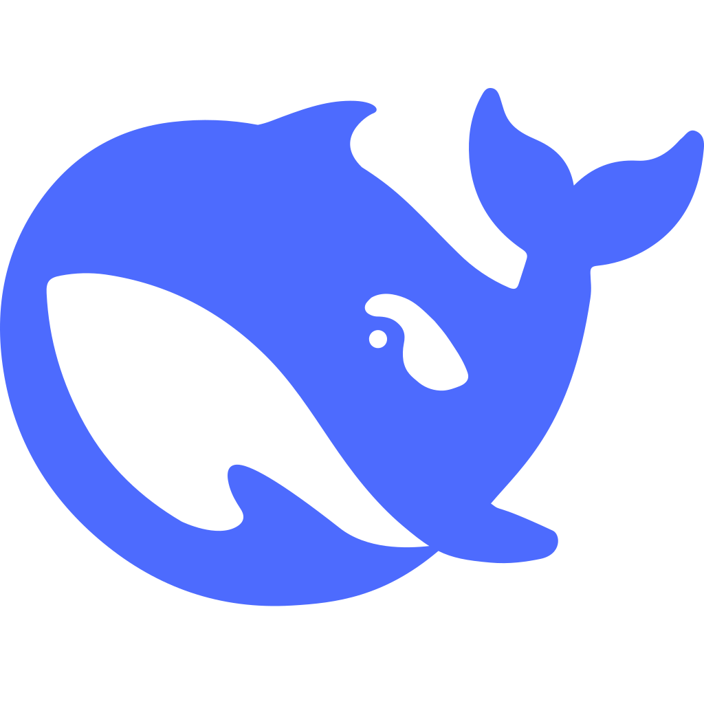

# DeepSeek-desktop-client

<div align="center">
  
  
  <h3>Desktop application for quick and convenient web content access</h3>
  <p align="center">English | <a href="README.zh.md">中文</a>  

  
  
  
  
</div>

## 📖 Project Introduction

DeepSeek is a desktop application developed based on Electron, designed to provide users with quick and convenient web content access experience. The application features a modern interface design and integrates rich functionality to make your web browsing more efficient and convenient.

## ✨ Features

- 🚀 **Fast Launch** - Built on Electron framework with quick startup
- 🎨 **Modern Interface** - Clean and beautiful UI design
- 🔧 **Custom Settings** - Supports personalized configuration options
- 📱 **Responsive Design** - Adapts to different screen sizes
- 🛡️ **Secure & Reliable** - Built-in secure preload scripts
- 🎯 **Context Menu** - Integrated electron-context-menu for enhanced user experience
- 🔄 **Auto Update** - Supports Squirrel auto-update mechanism
- 🪟 **Multi-Window Support** - Supports opening new windows and duplicating current window
- 🌐 **External Link Handling** - Automatically opens external links in system default browser

## 📦 Download & Installation

**System Requirements:**
- Windows 10 or later
- x64 architecture

**Installation Steps:**
1. Download the installation package
2. Double-click to run the installer
3. Complete installation following the wizard
4. Launch the application to start using

### Platform Notes

**🍎 macOS** and **🐧 Linux** versions are currently unavailable:

Due to development environment limitations, currently only Windows builds are available. Cross-platform builds for Electron require corresponding operating system environments:

- **macOS Version**: Requires building with Xcode on macOS system
- **Linux Version**: Requires building in Linux environment

If you have macOS or Linux environment, welcome to:
- Fork this project for cross-platform building
- Submit Pull Requests for other platform builds
- Submit cross-platform requests in Issues

## 🚀 Quick Start

### Development Environment

```bash
# Clone project
git clone https://github.com/YBMecho/DeepSeek.git
cd DeepSeek

# Install dependencies
npm install

# Start development mode
npm start

# Package application (Windows only)
npm run make
```

### Project Structure

```text
DeepSeek/
├── main.js              # Main process file
├── renderer.js          # Renderer process file
├── package.json         # Project configuration
├── forge.config.js      # Build configuration
├── public/              # Static resources
│   ├── css/            # Style files
│   ├── icons/          # Application icons
│   ├── images/         # Image resources
│   └── license.txt     # License agreement
└── README.md           # Project documentation
```

## 🛠️ Tech Stack

- **Framework**: [Electron](https://electronjs.org/) 37.2.6
- **Build Tool**: [Electron Forge](https://www.electronforge.io/) 7.8.3
- **UI Components**: electron-context-menu 4.1.0
- **Auto Update**: electron-squirrel-startup 1.0.1
- **Development Language**: JavaScript (Node.js)

## ⚙️ Customization Guide

### 📝 Modify App Info (`package.json`)

You can customize basic app information by modifying `package.json`:

```json
{
  "name": "DeepSeek",           // App name
  "version": "1.0.0",           // App version
  "description": "Quick and convenient web content access.", // App description
  "author": "YBMecho",          // Author info
  "license": "MIT",             // License type
  "keywords": [                 // Keywords
    "DeepSeek-app",
    "electron",
    "desktop"
  ]
}
```

### 🔧 Main Function Configuration (`main.js`)

#### 1. Modify Default Website

```javascript
// Modify default loaded website in createWindow()
mainWindow.loadURL('https://your-website.com/'); // Replace with your website

// Modify new window default website in createNewWindow()
function createNewWindow(url = 'https://your-website.com/') {
  // ...
}
```

#### 2. Customize Window Size and Appearance

```javascript
const newWindow = new BrowserWindow({
  width: 1280,              // Window width
  height: 730,              // Window height
  title: 'Your App Name',   // Window title
  icon: path.join(__dirname, 'public/images/your-icon.png'), // Window icon
  // Other configurations...
});
```

#### 3. Customize Context Menu

```javascript
contextMenu({
  labels: {
    cut: 'Cut',           // Custom menu item text
    copy: 'Copy',
    paste: 'Paste',
    // Add more custom labels...
  },
  prepend: (defaultActions, parameters, browserWindow) => [
    {
      label: 'Custom Feature',     // Add custom menu item
      click: () => {
        // Custom function code
      }
    },
    // Add more custom menu items...
  ]
});
```

#### 4. Modify App Info Dialog

```javascript
{
  label: 'About',
  click: () => {
    dialog.showMessageBox(browserWindow, {
      type: 'info',
      title: 'About Your App',        // Modify title
      message: 'Your App Desktop',   // Modify message
      detail: 'Version: 2.0.0\n\nYour app description\n\nAuthor: Your Name', // Modify details
      buttons: ['OK'],
      defaultId: 0
    });
  }
}
```

#### 5. Custom Domain Restrictions

```javascript
// Modify allowed domains
mainWindow.webContents.on('will-navigate', (event, navigationUrl) => {
  const allowedDomains = [
    'your-domain.com',
    'subdomain.your-domain.com',
    'api.your-service.com'
  ];
  
  const navigationDomain = new URL(navigationUrl).hostname;
  
  if (!allowedDomains.includes(navigationDomain)) {
    event.preventDefault();
    shell.openExternal(navigationUrl);
  }
});
```

### 🎨 UI Customization

#### 1. Modify CSS Styles

Add custom styles in `public/css/main.css`:

```css
/* Custom app styles */
body {
  font-family: 'Microsoft YaHei', sans-serif;
  background-color: #f5f5f5;
}

/* Hide specific elements */
.unwanted-element {
  display: none !important;
}

/* Custom scrollbar */
::-webkit-scrollbar {
  width: 8px;
}

::-webkit-scrollbar-track {
  background: #f1f1f1;
}

::-webkit-scrollbar-thumb {
  background: #888;
  border-radius: 4px;
}
```

#### 2. Dynamic Style Injection

```javascript
// Inject custom styles after page load
mainWindow.once('ready-to-show', () => {
  const customCSS = `
    .custom-style {
      color: #333;
      font-size: 14px;
    }
  `;
  mainWindow.webContents.insertCSS(customCSS);
});
```

### 🔐 Security Configuration

#### 1. Web Security Settings

```javascript
webPreferences: {
  nodeIntegration: false,        // Disable Node.js integration
  contextIsolation: true,        // Enable context isolation
  webSecurity: true,             // Enable web security
  allowRunningInsecureContent: false, // Prohibit insecure content
  experimentalFeatures: false    // Disable experimental features
}
```

#### 2. Content Security Policy

```javascript
// Set CSP before page load
mainWindow.webContents.session.webRequest.onHeadersReceived((details, callback) => {
  callback({
    responseHeaders: {
      ...details.responseHeaders,
      'Content-Security-Policy': ['default-src \'self\' https: data: blob:']
    }
  });
});
```

### 📱 Multi-Window Management

#### 1. Custom New Window Behavior

```javascript
function createCustomWindow(options = {}) {
  const defaultOptions = {
    width: 1280,
    height: 730,
    title: 'Custom Window',
    parent: mainWindow,  // Set parent window
    modal: true,         // Modal window
    // Other custom options...
  };
  
  const windowOptions = { ...defaultOptions, ...options };
  const newWindow = new BrowserWindow(windowOptions);
  
  return newWindow;
}
```

### 🚀 Build & Release Configuration

#### 1. Modify Build Configuration (`forge.config.js`)

```javascript
module.exports = {
  packagerConfig: {
    name: 'Your App Name',
    icon: 'public/icons/your-icon',
    appBundleId: 'com.yourcompany.yourapp',
    appCategoryType: 'public.app-category.productivity',
    // Other build options...
  },
  makers: [
    {
      name: '@electron-forge/maker-squirrel',
      config: {
        name: 'YourApp',
        authors: 'Your Name',
        description: 'Your app description',
        // Other configurations...
      }
    }
  ]
};
```

#### 2. Add Custom Scripts

```json
{
  "scripts": {
    "start": "electron-forge start",
    "dev": "electron .",
    "build": "electron-forge package",
    "dist": "electron-forge make",
    "clean": "rimraf out dist",
    "lint": "eslint .",
    "test": "jest"
  }
}
```

### 🔧 Advanced Customization

#### 1. Add System Tray

```javascript
const { Tray } = require('electron');

let tray = null;

function createTray() {
  tray = new Tray(path.join(__dirname, 'public/icons/tray-icon.png'));
  
  const contextMenu = Menu.buildFromTemplate([
    { label: 'Show', click: () => mainWindow.show() },
    { label: 'Hide', click: () => mainWindow.hide() },
    { type: 'separator' },
    { label: 'Quit', click: () => app.quit() }
  ]);
  
  tray.setToolTip('Your App Name');
  tray.setContextMenu(contextMenu);
}
```

#### 2. Add Global Shortcuts

```javascript
const { globalShortcut } = require('electron');

app.whenReady().then(() => {
  // Register global shortcut
  globalShortcut.register('CommandOrControl+Shift+D', () => {
    if (mainWindow.isVisible()) {
      mainWindow.hide();
    } else {
      mainWindow.show();
    }
  });
});
```

#### 3. Custom App Menu

```javascript
const template = [
  {
    label: 'File',
    submenu: [
      {
        label: 'New Window',
        accelerator: 'CmdOrCtrl+N',
        click: () => createNewWindow()
      },
      { type: 'separator' },
      {
        label: 'Quit',
        accelerator: process.platform === 'darwin' ? 'Cmd+Q' : 'Ctrl+Q',
        click: () => app.quit()
      }
    ]
  },
  // Add more menu items...
];

const menu = Menu.buildFromTemplate(template);
Menu.setApplicationMenu(menu);
```

## 📋 Development Notes

### Environment Requirements

- Node.js 18.x or later
- npm 8.x or later
- Windows 10 or later (for packaging)

### Build Steps

```bash
# Install dependencies
npm install

# Development debugging
npm run start

# Package application
npm run package

# Create installer
npm run make
```

### Code Signing

The project supports code signing for enhanced security:

1. Obtain code signing certificate (.pfx format)
2. Configure certificate path in `forge.config.js`
3. Rebuild to generate signed installer

## 🤝 Contribution Guide

Welcome contributions! Please follow these steps:

1. Fork this project
2. Create feature branch (`git checkout -b feature/AmazingFeature`)
3. Commit changes (`git commit -m 'Add some AmazingFeature'`)
4. Push to branch (`git push origin feature/AmazingFeature`)
5. Create Pull Request

### Contribution Priorities

- 🍎 **macOS Version Build** - Build on macOS environment
- 🐧 **Linux Version Build** - Build on Linux environment
- 🌐 **Internationalization** - Add multi-language support
- 🎨 **UI/UX Improvements** - Interface optimization and user experience enhancement
- 🐛 **Bug Fixes** - Discover and fix issues

## 📄 License

This project is open source under [MIT License](LICENSE).

## 🙏 Acknowledgments

- [Electron](https://electronjs.org/) - Cross-platform desktop app framework
- [Electron Forge](https://www.electronforge.io/) - Electron app packaging tool
- [electron-context-menu](https://github.com/sindresorhus/electron-context-menu) - Context menu enhancement

## 📞 Contact

- **Author**: YBMecho
- **QQ**: 3350198579
- **QQ Email**: 3350198579@qq.com

---

<div align="center">
  If this project helps you, please consider giving a ⭐ Star!
</div>
