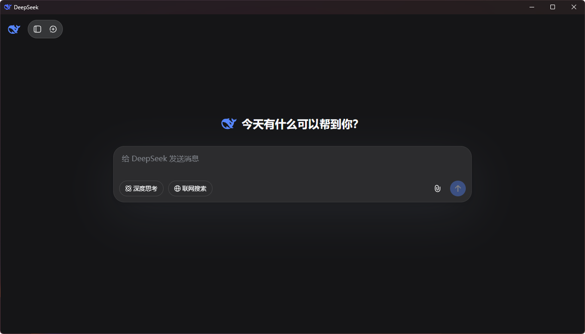
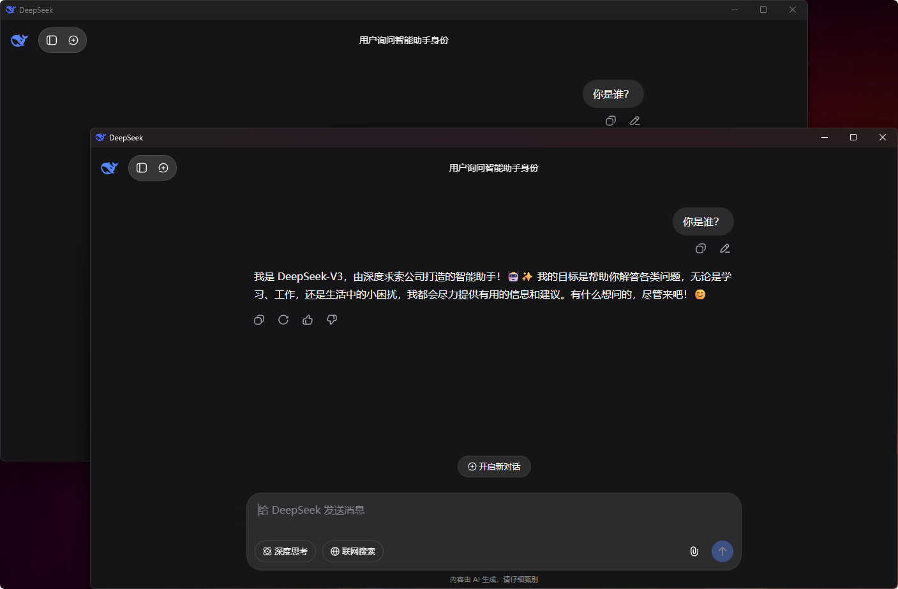
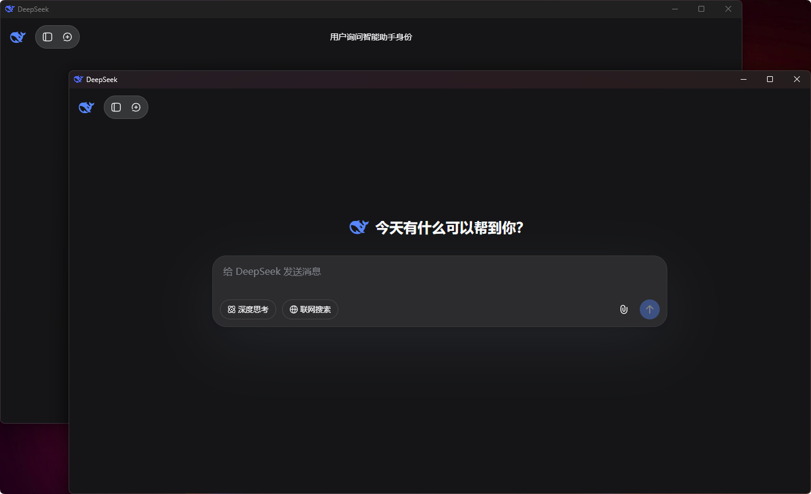
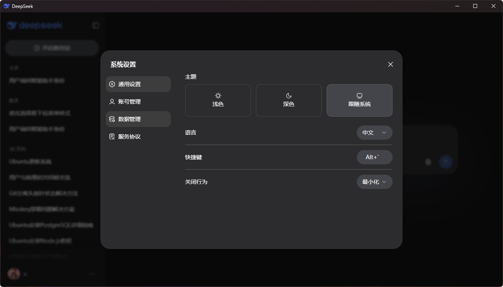

# DeepSeek-desktop-client

<div align="center">
  
  
  <h3>Put DeepSeek on your desktop — always a hotkey away</h3>
  <p align="center">English | <a href="README.zh.md">中文</a>

  
  
  
  
</div>

## 📖 Project Introduction

DeepSeek is an Electron desktop client, written in **TypeScript**, that wraps the DeepSeek web app in a native-feeling window. It's not a bare web wrapper, though — it layers on the things you'd actually want from a desktop app: a floating chat window, live replies in the taskbar, global hotkeys, theme switching, right-click file sending, and a notification the moment a reply lands. Most of it you can tweak right in the in-app settings panel, and changes take effect immediately.

## Screenshots

### Window Display


### Window Copy


### Multi-Window


### Settings Interface


## ✨ Features

- 🚀 **Fast to Start** - Built on a modular TypeScript codebase; launches quickly and stays light on resources
- ⌨️ **Global Hotkeys** - Hit `` Alt + ` `` to summon the main window, `Alt + Space` to toggle the floating chat
- 🪟 **Multi-Window** - Open a new window, duplicate the current one, or hop between them without losing your place
- 🌊 **Floating Chat Window** - A compact window that floats above everything else. Pin it, drag it, resize it, or let it start a fresh chat after a quiet spell
- 📺 **Taskbar Live Controls** - Watch replies stream in from a taskbar mini-window, with an edge dock for one-click access
- 🖱️ **Right-Click Send File** - Send a file straight into the current chat from the right-click menu
- 🎨 **Themes** - Light, dark, or follow your system — switch on the fly, no restart needed
- 🔔 **Reply Notifications** - A system notification pops the moment a reply finishes; click it to bring the window back
- ⚙️ **Close Behavior** - Close to exit, or tuck it into the system tray and keep it running — your call
- 🔄 **System Tray** - A tray icon that always stays put, with a right-click menu for the essentials
- 🚀 **Auto Launch** - Start with Windows, silently tucked into the tray if you prefer
- 📌 **Default Conversation Mode** - Set new chats to start in quick, expert, or image mode
- 🎛️ **In-App Settings** - Hotkeys, floating-window options, and an About page all live inside the settings panel
- 🌐 **External Links** - Outside links open in your default browser rather than inside the app
- 🔒 **Settings Persistence** - Everything is saved to `config.json` and picked right back up next launch

## 📦 Download and Installation

**System Requirements:**
- Windows 10 or higher
- x64 architecture

**Installation Steps:**
1. Download the installation package (if you're in China or have a slow download, you can get it from the gitee mirror [download](https://gitee.com/mE7aT89S78xVmNhsydwNuS5EpTrEOGF4/deep-seek-desktop-client).)
2. Double-click to run the installer
3. Complete the installation according to the installation wizard
4. Start the application to begin using

### Notes on Other Platforms

**🍎 macOS** and **🐧 Linux** versions are not currently available:

Due to development environment limitations, packaging and building can currently only be done on Windows systems. Cross-platform packaging for Electron requires building in the corresponding operating system environment, therefore:

- **macOS version**: Needs to be built on macOS system using Xcode
- **Linux version**: Needs to be packaged in a Linux environment

If you have a macOS or Linux environment, welcome to:
- Fork this project for cross-platform building
- Submit a Pull Request to contribute builds for other platforms
- Raise cross-platform requirements in Issues

## 🚀 Quick Start

### Project Structure

```text
DeepSeek-desktop-client/
├── src/                      # Source code (TypeScript)
│   ├── main/                 # Main process
│   │   ├── window/           # Window management (main, floating, taskbar mini, adsorption)
│   │   ├── system/           # System integration (tray, hotkey, theme, notification, auto-launch)
│   │   ├── config/           # Configuration management
│   │   ├── ipc/              # IPC handlers
│   │   ├── state.ts          # Global state
│   │   └── index.ts          # Main process entry
│   ├── preload/              # Preload scripts (context-isolated bridge)
│   ├── renderer/             # Renderer-side injection
│   │   ├── injectors/        # Asset injectors (CSS/JS injection into the page)
│   │   ├── services/         # Renderer services (e.g. theme sync)
│   │   └── ui/               # UI components (hotkey settings, about page, floating-window buttons…)
│   └── common/               # Shared code
│       └── constants.ts      # Global constants & default config
├── resources/                # Static resources
│   ├── assets/               # App icons and images
│   ├── styles/               # CSS files (main theme, adsorption, taskbar live controls)
│   └── docs/                 # Documentation & references
├── pho/                      # README screenshots
├── forge.config.ts           # Electron Forge packaging config
├── build.js                  # Installer build script (Squirrel / Inno Setup)
├── deepseek-installer.iss    # Inno Setup installer script
├── package.json
└── tsconfig.json
```

## 🛠️ Technology Stack

- **Framework**: [Electron](https://electronjs.org/) 37.2.6
- **Language**: [TypeScript](https://www.typescriptlang.org/) (strict mode)
- **Packaging Tool**: [Electron Forge](https://www.electronforge.io/) 7.8.3 + [Inno Setup](https://jrsoftware.org/isinfo.php) (Chinese installer)
- **UI Enhancement**: [electron-context-menu](https://github.com/sindresorhus/electron-context-menu) 4.1.0
- **Other Dependencies**: markdown-it (taskbar live content), electron-squirrel-startup

## ⚙️ Application Settings Guide

All settings can be configured in the application's settings page (shortcut settings / About are embedded inside the settings panel). Settings take effect in real time and are saved automatically.

#### 1. ⌨️ Global Hotkey

- Custom global hotkey to quickly show/hide the DeepSeek window
- Default: `` Alt + ` ``
- Requires at least one modifier key (Ctrl, Alt, Shift)
- Double-click the input box to restore the default value

#### 2. 🪟 Floating Window Hotkey

- Custom global hotkey to toggle the floating conversation window
- Default: `Alt + Space`

#### 3. 🎨 Theme Settings

- **Light Theme**: bright visual style
- **Dark Theme**: dark style, easier on the eyes
- **Follow System**: automatically follows the system theme (default)

#### 4. ⚙️ Close Behavior

- **Minimize to Tray**: closing the window minimizes it to the system tray and keeps running (default)
- **Close Directly**: closing the window exits the application

#### 5. 🔔 Reply Notification

- When enabled (default), the system shows a notification once a reply finishes; clicking it brings the window to the front

#### 6. 🚀 Auto Launch

- **Auto Launch**: start with Windows (default on)
- **Silent Launch**: start hidden in the system tray without showing the window (default on)

#### 7. 🌊 Floating Window Options

- **Pin on Top**: keep the floating window above other windows
- **Auto Reset**: reset to a new chat after the configured idle time (default `60min`)

#### 8. 📌 Default Conversation Mode

- Choose the default mode for new chats: quick / expert / image

#### 9. 🖱️ Right-Click Send File

- When enabled (default), the right-click menu offers "send file", which uploads the file to the current DeepSeek chat

#### 10. 📺 Taskbar Live Controls

- When enabled, a taskbar mini window shows the current reply content live, with an adsorption window on the screen edge

### 📂 Configuration File

**Configuration File Location**: `%APPDATA%/DeepSeek/config.json`

**Configuration File Structure**:
```json
{
  "hotkey": "Alt+`",
  "floatingWindowHotkey": "Alt+Space",
  "theme": "system",
  "closeBehavior": "minimize",
  "replyNotifyEnabled": true,
  "isFloatingWindowPinned": false,
  "autoLaunch": true,
  "silentAutoLaunch": true,
  "floatingResetOption": "60min",
  "defaultMode": "quick",
  "contextMenuEnabled": true,
  "taskbarControlsEnabled": false,
  "taskbarControlsPosition": null
}
```

## 📋 Development Instructions

### Environment Requirements

- Node.js 20.x or higher
- npm 10.x or higher
- Windows 10 or higher (for packaging & installer)

### Build Steps

```bash
# Install dependencies
npm install

# Development debugging (compile then launch)
npm run dev

# Build and start
npm run start

# Auto-reload during development
npm run dev:auto

# Lint
npm run lint

# Package the application
npm run package

# Create the installer (Squirrel)
npm run make

# Create the Chinese Inno Setup installer
node build.js inno
# or on Windows
build.bat
```

### Code Signing

The project supports code signing to enhance security:

1. Obtain a code signing certificate (.pfx format)
2. Configure the certificate path in `forge.config.ts`
3. Re-package to generate a signed installation package

## 🐛 Troubleshooting

#### 1. Hotkeys Not Working

**Problem**: The configured hotkey cannot trigger window show/hide
**Solution**:
- Check whether the hotkey is occupied by other applications
- Ensure the hotkey contains at least one modifier key (Ctrl, Alt, Shift, etc.)
- Try resetting the hotkey or use the default `` Alt + ` ``

#### 2. Application Won't Start

**Problem**: No response after double-clicking the application icon
**Solution**:
- Check Windows firewall and antivirus software settings
- Try running with administrator privileges
- Reinstall the application

#### 3. Settings Not Saving

**Problem**: Settings are lost after restarting the application
**Solution**:
- Check whether the `%APPDATA%/DeepSeek/` directory has write permissions
- Delete the configuration file `%APPDATA%/DeepSeek/config.json` and restart the application
- Ensure there is sufficient disk space

#### 4. System Tray Icon Missing

**Problem**: Cannot find the tray icon
**Solution**:
- Check system tray settings, ensure all icons are displayed
- Use Task Manager to check whether the application is running
- Restart the application

#### 5. Theme Switching Invalid

**Problem**: The interface does not change after switching themes
**Solution**:
- Refresh the page (Ctrl+R or F5)
- Check whether "Follow System" theme is selected
- Clear the cache and restart the application

## 📝 Version Changelog

### 🎉 Version 2.5.1

- 🔢 **Unified Version Management** - The version number is now controlled by a single source (`package.json`), the About page shows the actually installed version, and the installer filename stays in sync automatically. The installer AppId is a fixed GUID, so new versions overwrite previous installs cleanly

### 🎉 Version 2.5.0

- 🛠️ **TypeScript Refactor** - The entire codebase is rewritten in strict-mode TypeScript, split into a modular architecture (`src/main`, `src/preload`, `src/renderer`, `src/common`)
- 🌊 **Floating Conversation Window** - Independent always-on-top conversation panel with pin, drag, resize and auto reset
- 📺 **Taskbar Live Controls** - Taskbar mini window with live reply display and an adsorption window
- 🖱️ **Right-Click Send File** - Send files to the current chat from the enhanced context menu
- 🔔 **Reply Notifications** - System notification when a reply completes
- 🚀 **Auto Launch & Silent Launch** - Start with Windows, optionally hidden in the tray
- 📌 **Default Conversation Mode** - Quick / expert / image mode selection
- 🎛️ **Embedded Settings Panel** - Hotkey settings and an About page embedded in the settings panel
- 📦 **Chinese Inno Setup Installer** - Simplified-Chinese installation package
- 🔄 **Always-visible System Tray** - The tray icon is created at startup and no longer follows window visibility

### 📅 Version 2.0.0

- ⌨️ **Global Hotkey System** - Custom hotkeys to quickly show/hide the window
- 🎨 **Theme Support** - Light, dark and follow-system themes
- ⚙️ **Close Behavior Settings** - Minimize to tray or close directly
- 🔄 **System Tray Integration** - Background running, right-click menu quick operations
- 📂 **Configuration Management** - Persistent storage and recovery of user settings
- 🎛️ **Settings Interface** - Intuitive in-app settings page

### 📅 Version 1.0.0

- ✨ Initial version release
- 🎨 Basic user interface design
- 🪟 Multi-window support
- 🌐 External link handling
- 🛡️ Basic security features

### 🔮 Planned Updates

- 🍎 **macOS Version Support** - Build the application in a macOS environment
- 🐧 **Linux Version Support** - Build the application in a Linux environment
- 🌐 **Multi-language Interface** - Add English, Japanese and other languages
- 📱 **More Customization Options** - Window size, transparency and other settings
- 🔄 **Auto Update Mechanism** - Smart detection and installation of updates

## 🤝 Contribution Guide

Welcome to contribute code! Please follow these steps:

1. Fork this project
2. Create a feature branch (`git checkout -b feature/AmazingFeature`)
3. Commit changes (`git commit -m 'Add some AmazingFeature'`)
4. Push to the branch (`git push origin feature/AmazingFeature`)
5. Create a Pull Request

### Contribution Focus

- 🍎 **macOS Version Building** - Packaging in a macOS environment
- 🐧 **Linux Version Building** - Packaging in a Linux environment
- 🌐 **Internationalization Support** - Add multi-language interface
- 🎨 **UI/UX Improvements** - Interface optimization and user experience enhancement
- 🐛 **Bug Fixes** - Discover and fix issues

## 📄 License

This project is open source under the [MIT License](LICENSE).

## 🙏 Acknowledgments

- [Electron](https://electronjs.org/) - Cross-platform desktop application development framework
- [Electron Forge](https://www.electronforge.io/) - Electron application packaging tool
- [electron-context-menu](https://github.com/sindresorhus/electron-context-menu) - Right-click menu enhancement

## 📞 Contact Information

- **Author**: YBMecho · zisekongling
- **QQ Group**: 704156190
- **QQ Email**: 3350198579@qq.com

---

<div align="center">
  If this project is helpful to you, please consider giving a ⭐ Star!
</div>
