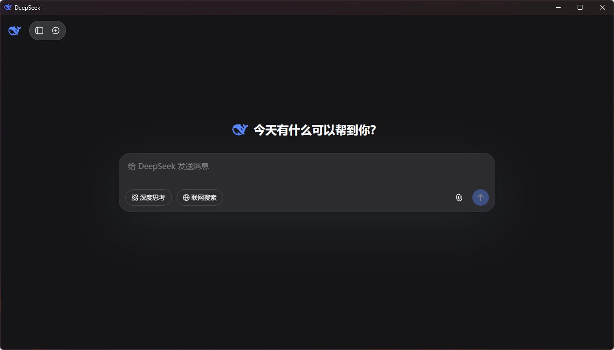
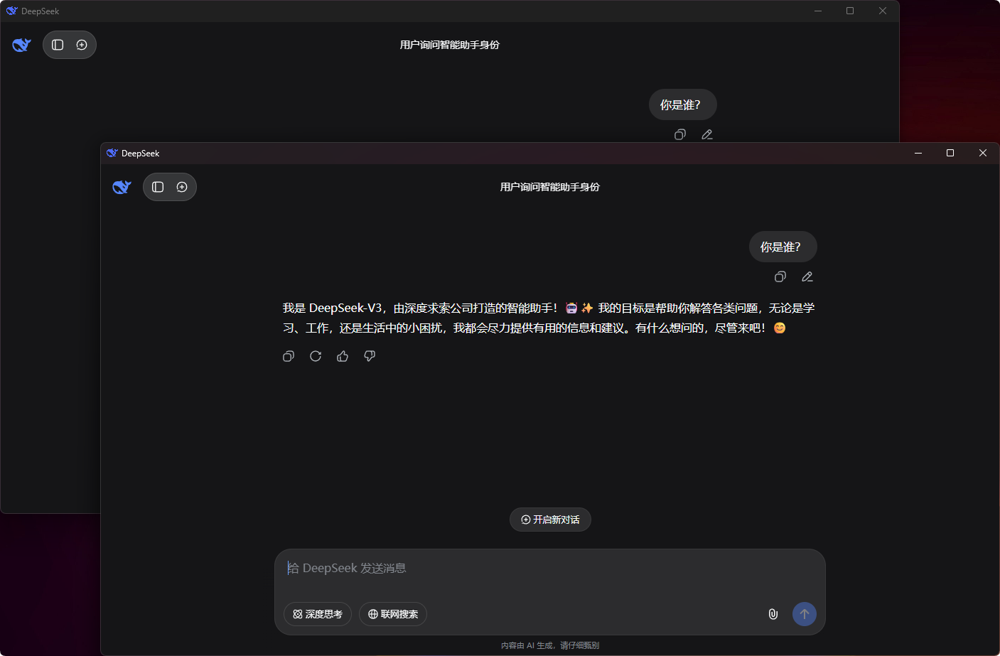
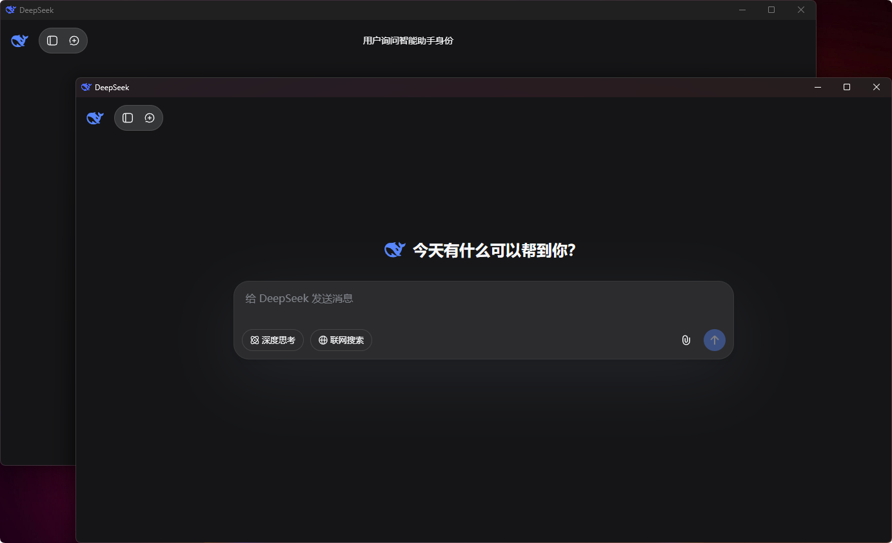
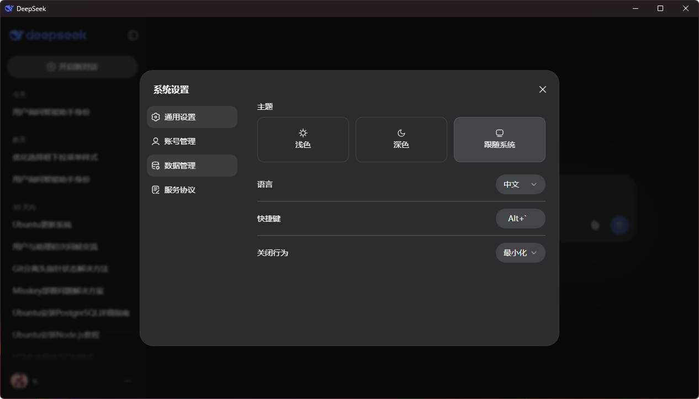

# DeepSeek-desktop-client

<div align="center">
  
  
  <h3>方便快捷打开网页内容的桌面应用程序</h3>
  <p align="center"><a href="README.md">English</a> | 中文

  
  
  
  
</div>

## 📖 项目介绍

DeepSeek 是一个基于 Electron 开发的桌面应用程序，旨在为用户提供方便快捷的网页内容访问体验。应用采用现代化的界面设计，集成了丰富的功能特性，让您的网页浏览更加高效便捷，但不完全是套壳网页软件。

## 窗口展示：


## 窗口复制：


## 窗口多开：


## 设置界面：



## ✨ 功能特性

- 🚀 **快速启动** - 基于 Electron 框架，启动速度快，优化的资源使用
- 🎨 **现代界面** - 简洁美观的用户界面设计，支持浅色/深色主题
- ⌨️ **全局快捷键** - 自定义快捷键快速显示/隐藏窗口（默认 Alt+`）
- 🔧 **智能设置** - 丰富的个性化配置选项，设置实时生效
- 🪟 **多窗口管理** - 支持新开窗口、复制当前窗口和智能窗口切换
- 📱 **响应式设计** - 适应不同屏幕尺寸，优化的显示效果
- 🛡️ **安全可靠** - 内置安全预加载脚本，域名访问控制
- 🎯 **右键菜单** - 集成 electron-context-menu 增强用户体验
- 🔄 **系统托盘** - 支持最小化到系统托盘，后台运行
- 🌐 **外链处理** - 自动在系统默认浏览器中打开外部链接
- 🎨 **主题支持** - 支持浅色、深色和跟随系统主题
- ⚙️ **关闭行为** - 可选择直接关闭或最小化到托盘
- 🔒 **配置持久化** - 用户设置自动保存和恢复

## 📦 下载安装

**系统要求：**
- Windows 10 或更高版本
- x64 架构

**安装步骤：**
1. 下载安装包（如果国内下载不了/下载速度慢，可以来这里gitee[下载](https://gitee.com/mE7aT89S78xVmNhsydwNuS5EpTrEOGF4/DeepSeek-desktop-client)。）
2. 双击运行安装程序
3. 按照安装向导完成安装
4. 启动应用开始使用

### 其他平台说明

**🍎 macOS** 和 **🐧 Linux** 版本暂未提供：

由于开发环境限制，目前只能在 Windows 系统上进行打包构建。Electron 的跨平台打包需要在对应的操作系统环境中进行，因此：

- **macOS 版本**：需要在 macOS 系统上使用 Xcode 进行构建
- **Linux 版本**：需要在 Linux 环境中进行打包

如果您有 macOS 或 Linux 环境，欢迎：
- Fork 本项目进行跨平台构建
- 提交 Pull Request 贡献其他平台的构建版本
- 在 Issues 中提出跨平台需求

## 🚀 快速开始

### 项目结构

```text
DeepSeek-desktop-client/
├── main.js                    # 主进程文件
├── preload.js                 # 预加载脚本
├── package.json               # 项目配置
├── forge.config.js            # 打包配置
├── public/                    # 静态资源
│   ├── css/
│   │   └── main.css          # 主样式文件（主题和滚动条）
│   ├── js/
│   │   └── hotkey-settings.js # 快捷键设置脚本
│   ├── icons/                # 应用图标
│   │   ├── icon.png
│   │   ├── lp25u-mafhn-001.ico
│   │   └── lp25u-mafhn-001.png
│   └── images/               # 图片资源
│       └── deepseek-color.png
├── resource/                  # 开发资源
│   ├── html/                 # UI界面代码示例
│   └── *.png                 # 项目截图
├── README.md                  # 英文说明文档
├── README.zh.md              # 中文说明文档（本文档）
└── 项目文档.md               # 详细项目文档
```

## 🛠️ 技术栈

- **框架**: [Electron](https://electronjs.org/) 37.2.6
- **打包工具**: [Electron Forge](https://www.electronforge.io/) 7.8.3
- **UI组件**: electron-context-menu 4.1.0
- **自动更新**: electron-squirrel-startup 1.0.1
- **开发语言**: JavaScript (Node.js)

## ⚙️ 应用设置指南

### 🎛️ 用户设置功能

**DeepSeek 2.0** 新增了丰富的用户设置功能，所有设置都可以在应用内的设置页面进行配置，设置会实时生效并自动保存。

#### 1. ⌨️ 快捷键设置

**功能说明**：
- 自定义全局快捷键来快速显示/隐藏 DeepSeek 窗口
- 默认快捷键：`Alt + \``
- 支持各种修饰键组合（Ctrl、Alt、Shift、Cmd）

**使用方法**：
1. 点击应用内的设置按钮
2. 在快捷键设置区域点击输入框
3. 按下您想要的快捷键组合
4. 设置会自动保存并立即生效
5. 双击快捷键设置可恢复默认值

**注意事项**：
- 快捷键必须包含至少一个修饰键（Ctrl、Alt、Shift等）
- 如果快捷键被其他应用占用，可能无法正常工作
- 建议使用不常用的快捷键组合以避免冲突

#### 2. 🎨 主题设置

**主题选项**：
- **浅色主题**：适合明亮环境使用，提供清晰的视觉体验
- **深色主题**：适合暗光环境，保护视力，减少眼部疲劳
- **跟随系统**：自动跟随系统主题设置变化

**特色功能**：
- 主题切换实时生效，无需重启应用
- 自定义滚动条样式，支持主题自适应
- 所有UI元素完全支持主题切换

#### 3. ⚙️ 关闭行为设置

**行为选项**：
- **最小化到托盘**：点击关闭按钮时，应用最小化到系统托盘继续运行
- **直接关闭**：点击关闭按钮时，应用直接退出

**托盘功能**：
- 右键托盘图标可快速访问常用功能
- 双击托盘图标可恢复窗口显示
- 托盘菜单包含显示/隐藏、设置、退出等选项

#### 4. 📂 配置文件

**配置文件位置**：`%APPDATA%/DeepSeek/config.json`

**配置文件结构**：
```json
{
  "hotkey": "Alt+`",           // 全局快捷键
  "theme": "system",           // 主题设置 (light/dark/system)
  "closeBehavior": "minimize"  // 关闭行为 (minimize/close)
}
```

### 🛠️ 开发自定义指南

#### 📝 修改应用信息 (`package.json`)

您可以通过修改 `package.json` 文件来自定义应用的基本信息：

```json
{
  "name": "DeepSeek",           // 应用名称
  "version": "2.0.0",           // 应用版本
  "description": "方便快捷打开网页内容。", // 应用描述
  "author": "YBMecho",          // 作者信息
  "license": "MIT",             // 许可证类型
  "keywords": [                 // 关键词
    "DeepSeek-app",
    "electron",
    "desktop"
  ]
}
```

### 🔧 主要功能配置 (`main.js`)

#### 1. 修改默认网站

```javascript
// 在 createWindow() 函数中修改默认加载的网站
mainWindow.loadURL('https://your-website.com/'); // 替换为您的网站

// 在 createNewWindow() 函数中修改新窗口的默认网站
function createNewWindow(url = 'https://your-website.com/') {
  // ...
}
```

#### 2. 自定义窗口尺寸和外观

```javascript
const newWindow = new BrowserWindow({
  width: 1280,              // 窗口宽度
  height: 730,              // 窗口高度
  title: 'Your App Name',   // 窗口标题
  icon: path.join(__dirname, 'public/images/your-icon.png'), // 窗口图标
  // 其他配置...
});
```

#### 3. 自定义右键菜单

```javascript
contextMenu({
  labels: {
    cut: '剪切',           // 自定义菜单项文本
    copy: '复制',
    paste: '粘贴',
    // 添加更多自定义标签...
  },
  prepend: (defaultActions, parameters, browserWindow) => [
    {
      label: '自定义功能',     // 添加自定义菜单项
      click: () => {
        // 自定义功能代码
      }
    },
    // 添加更多自定义菜单项...
  ]
});
```

#### 4. 修改应用信息对话框

```javascript
{
  label: '关于',
  click: () => {
    dialog.showMessageBox(browserWindow, {
      type: 'info',
      title: '关于 Your App',        // 修改标题
      message: 'Your App 桌面应用',   // 修改消息
      detail: '版本: 2.0.0\n\n您的应用描述\n\n作者: Your Name', // 修改详细信息
      buttons: ['确定'],
      defaultId: 0
    });
  }
}
```

#### 5. 自定义域名限制

```javascript
// 修改允许的域名范围
mainWindow.webContents.on('will-navigate', (event, navigationUrl) => {
  const allowedDomains = [
    'your-domain.com',
    'subdomain.your-domain.com',
    'api.your-service.com'
  ];
  
  const navigationDomain = new URL(navigationUrl).hostname;
  
  if (!allowedDomains.includes(navigationDomain)) {
    event.preventDefault();
    shell.openExternal(navigationUrl);
  }
});
```

### 🎨 界面样式自定义

#### 1. 修改 CSS 样式

在 `public/css/main.css` 中添加自定义样式：

```css
/* 自定义应用样式 */
body {
  font-family: 'Microsoft YaHei', sans-serif;
  background-color: #f5f5f5;
}

/* 隐藏特定元素 */
.unwanted-element {
  display: none !important;
}

/* 自定义滚动条 */
::-webkit-scrollbar {
  width: 8px;
}

::-webkit-scrollbar-track {
  background: #f1f1f1;
}

::-webkit-scrollbar-thumb {
  background: #888;
  border-radius: 4px;
}
```

#### 2. 动态注入样式

```javascript
// 在页面加载完成后注入自定义样式
mainWindow.once('ready-to-show', () => {
  const customCSS = `
    .custom-style {
      color: #333;
      font-size: 14px;
    }
  `;
  mainWindow.webContents.insertCSS(customCSS);
});
```

### 🔐 安全配置

#### 1. Web 安全设置

```javascript
webPreferences: {
  nodeIntegration: false,        // 禁用 Node.js 集成
  contextIsolation: true,        // 启用上下文隔离
  webSecurity: true,             // 启用 Web 安全
  allowRunningInsecureContent: false, // 禁止不安全内容
  experimentalFeatures: false    // 禁用实验性功能
}
```

#### 2. 内容安全策略

```javascript
// 在页面加载前设置 CSP
mainWindow.webContents.session.webRequest.onHeadersReceived((details, callback) => {
  callback({
    responseHeaders: {
      ...details.responseHeaders,
      'Content-Security-Policy': ['default-src \'self\' https: data: blob:']
    }
  });
});
```

### 📱 多窗口管理

#### 1. 自定义新窗口行为

```javascript
function createCustomWindow(options = {}) {
  const defaultOptions = {
    width: 1280,
    height: 730,
    title: 'Custom Window',
    parent: mainWindow,  // 设置父窗口
    modal: true,         // 模态窗口
    // 其他自定义选项...
  };
  
  const windowOptions = { ...defaultOptions, ...options };
  const newWindow = new BrowserWindow(windowOptions);
  
  return newWindow;
}
```

### 🚀 构建和发布配置

#### 1. 修改打包配置 (`forge.config.js`)

```javascript
module.exports = {
  packagerConfig: {
    name: 'Your App Name',
    icon: 'public/icons/your-icon',
    appBundleId: 'com.yourcompany.yourapp',
    appCategoryType: 'public.app-category.productivity',
    // 其他打包选项...
  },
  makers: [
    {
      name: '@electron-forge/maker-squirrel',
      config: {
        name: 'YourApp',
        authors: 'Your Name',
        description: 'Your app description',
        // 其他配置...
      }
    }
  ]
};
```

#### 2. 添加自定义脚本

```json
{
  "scripts": {
    "start": "electron-forge start",
    "dev": "electron .",
    "build": "electron-forge package",
    "dist": "electron-forge make",
    "clean": "rimraf out dist",
    "lint": "eslint .",
    "test": "jest"
  }
}
```

### 🔧 高级自定义

#### 1. 添加系统托盘

```javascript
const { Tray } = require('electron');

let tray = null;

function createTray() {
  tray = new Tray(path.join(__dirname, 'public/icons/tray-icon.png'));
  
  const contextMenu = Menu.buildFromTemplate([
    { label: '显示', click: () => mainWindow.show() },
    { label: '隐藏', click: () => mainWindow.hide() },
    { type: 'separator' },
    { label: '退出', click: () => app.quit() }
  ]);
  
  tray.setToolTip('Your App Name');
  tray.setContextMenu(contextMenu);
}
```

#### 2. 添加全局快捷键

```javascript
const { globalShortcut } = require('electron');

app.whenReady().then(() => {
  // 注册全局快捷键
  globalShortcut.register('CommandOrControl+Shift+D', () => {
    if (mainWindow.isVisible()) {
      mainWindow.hide();
    } else {
      mainWindow.show();
    }
  });
});
```

#### 3. 自定义应用菜单

```javascript
const template = [
  {
    label: '文件',
    submenu: [
      {
        label: '新建窗口',
        accelerator: 'CmdOrCtrl+N',
        click: () => createNewWindow()
      },
      { type: 'separator' },
      {
        label: '退出',
        accelerator: process.platform === 'darwin' ? 'Cmd+Q' : 'Ctrl+Q',
        click: () => app.quit()
      }
    ]
  },
  // 添加更多菜单项...
];

const menu = Menu.buildFromTemplate(template);
Menu.setApplicationMenu(menu);
```

## 📋 开发说明

### 环境要求

- Node.js 18.x 或更高版本
- npm 8.x 或更高版本
- Windows 10 或更高版本（用于打包）

### 构建步骤

```bash
# 安装依赖
npm install

# 开发调试
npm run start

# 打包应用
npm run package

# 制作安装包
npm run make
```

### 代码签名

项目支持代码签名以增强安全性：

1. 获取代码签名证书（.pfx 格式）
2. 在 `forge.config.js` 中配置证书路径
3. 重新打包即可生成签名的安装包

## 🐛 故障排除

### 常见问题

#### 1. 快捷键不生效
**问题**：设置的快捷键无法触发窗口显示/隐藏
**解决方案**：
- 检查快捷键是否被其他应用程序占用
- 确保快捷键包含至少一个修饰键（Ctrl、Alt、Shift等）
- 尝试重新设置快捷键或使用默认快捷键 `Alt + \``

#### 2. 应用无法启动
**问题**：双击应用图标后无反应
**解决方案**：
- 检查 Windows 防火墙和杀毒软件设置
- 尝试以管理员权限运行
- 重新安装应用程序

#### 3. 设置无法保存
**问题**：修改设置后重启应用设置丢失
**解决方案**：
- 检查 `%APPDATA%/DeepSeek/` 目录是否有写入权限
- 删除配置文件：`%APPDATA%/DeepSeek/config.json`，然后重启应用
- 确保磁盘空间充足

#### 4. 系统托盘图标消失
**问题**：最小化后找不到托盘图标
**解决方案**：
- 检查系统托盘设置，确保显示所有图标
- 使用任务管理器检查应用程序是否在运行
- 重启应用程序

#### 5. 主题切换无效
**问题**：切换主题后界面没有变化
**解决方案**：
- 刷新页面（Ctrl+R 或 F5）
- 检查是否选择了"跟随系统"主题
- 清除浏览器缓存并重启应用

### 调试信息

#### 开发者工具
- 按 `F12` 或 `Ctrl+Shift+I` 打开开发者工具
- 查看控制台输出获取错误信息
- 使用网络面板检查网络请求

#### 配置文件位置
- 用户配置：`%APPDATA%/DeepSeek/config.json`
- 日志文件：应用程序目录下的控制台输出

## 📝 版本更新日志

### 🎉 版本 2.0.0（当前版本）

**🆕 新增功能**：
- ⌨️ **全局快捷键系统** - 自定义快捷键快速显示/隐藏窗口
- 🎨 **主题支持** - 浅色、深色和跟随系统主题
- ⚙️ **关闭行为设置** - 支持最小化到托盘或直接关闭
- 🔄 **系统托盘集成** - 后台运行，右键菜单快速操作
- 📂 **配置管理** - 用户设置持久化存储和恢复
- 🎛️ **设置界面** - 直观的应用内设置页面

**✨ 功能改进**：
- 🚀 优化启动速度和资源使用
- 🎨 改进用户界面设计和交互体验
- 🔒 增强安全性和稳定性
- 🪟 改进多窗口管理功能

**🛠️ 技术升级**：
- 更新 Electron 框架到最新版本
- 优化代码结构和性能
- 增强错误处理和日志记录

### 📅 版本 1.0.0

- ✨ 初始版本发布
- 🎨 基础用户界面设计
- 🪟 多窗口支持
- 🌐 外部链接处理
- 🛡️ 基础安全功能

### 🔮 计划更新

- 🍎 **macOS 版本支持** - 在 macOS 环境中构建应用
- 🐧 **Linux 版本支持** - 在 Linux 环境中构建应用
- 🌐 **多语言界面支持** - 添加英语、日语等语言
- 📱 **更多自定义选项** - 窗口大小、透明度等设置
- 🔄 **自动更新机制** - 智能检测和安装更新

## 🤝 贡献指南

欢迎贡献代码！请按照以下步骤：

1. Fork 本项目
2. 创建特性分支 (`git checkout -b feature/AmazingFeature`)
3. 提交更改 (`git commit -m 'Add some AmazingFeature'`)
4. 推送到分支 (`git push origin feature/AmazingFeature`)
5. 创建 Pull Request

### 贡献重点

- 🍎 **macOS 版本构建** - 在 macOS 环境中进行打包
- 🐧 **Linux 版本构建** - 在 Linux 环境中进行打包
- 🌐 **国际化支持** - 添加多语言界面
- 🎨 **UI/UX 改进** - 界面优化和用户体验提升
- 🐛 **Bug 修复** - 发现并修复问题

## 📄 许可证

本项目基于 [MIT 许可证](LICENSE) 开源。

## 🙏 致谢

- [Electron](https://electronjs.org/) - 跨平台桌面应用开发框架
- [Electron Forge](https://www.electronforge.io/) - Electron 应用打包工具
- [electron-context-menu](https://github.com/sindresorhus/electron-context-menu) - 右键菜单增强

## 📞 联系方式

- **作者**: YBMecho
- **QQ**: 3350198579
- **QQ邮箱**: 3350198579@qq.com

---

<div align="center">
  如果这个项目对您有帮助，请考虑给一个 ⭐ Star！
</div>

<p align="center">
  <sub>本项目使用 <a href="https://cursor.sh">Cursor</a> 开发，被人爱好喜欢AI编写代码，当个人并不是完全会编写代码。</sub>
</p>
